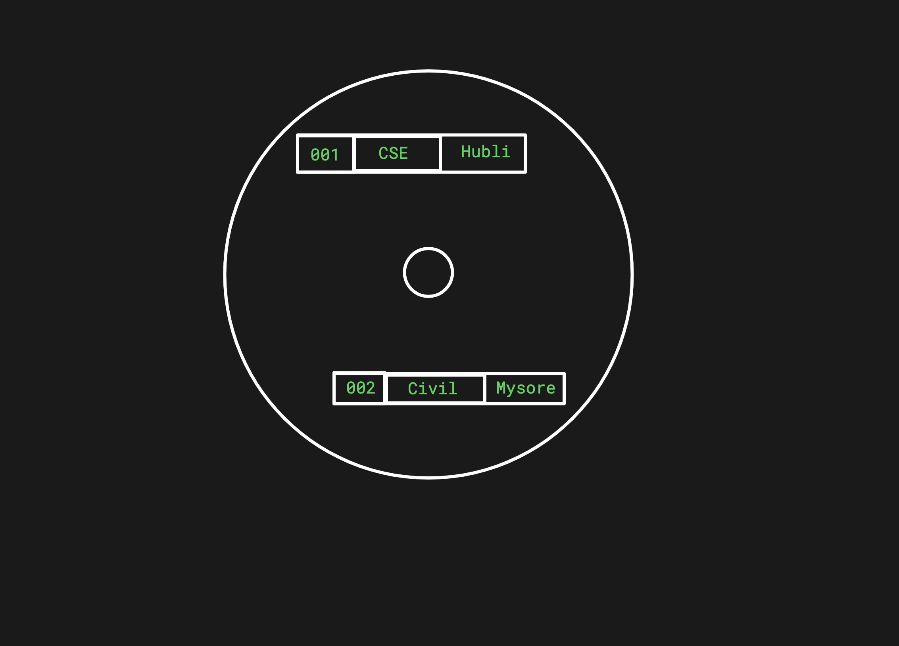
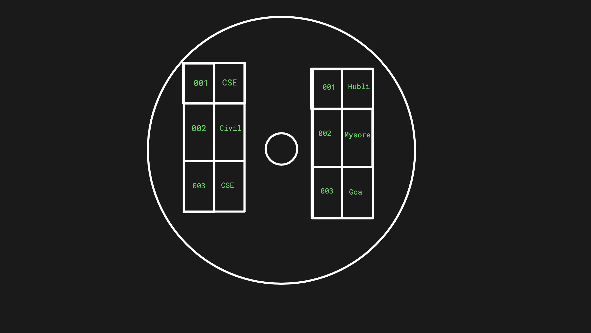

We are all familiar that Hbase is a NoSQL datastore. Let us go one level deeper to understand how it works on a high level. 

# Hbase is a key-value store 
Every chunk of data you put in it needs a key that is unique. You can get back this data only if you know what is the key associated with it. Unlike SQL databases, indexes are not possible. For example, if you store student information like this:

| UniversitySudentNumber | StudentInformation |
| --- | -- |
| 2021CS001 | {"Name": "Aparna", "Branch" : "CSE", "City": "Bengaluru" } |

To get the information out of this table, you need to know the `UniversitySudentNumber` that is the key. It is not easy to get information of students belonging to `CSE` branch or from the city "Bengaluru".

# Hbase is a NoSQL datastore
If you are familiar with relational databases, you will be familiar with schemas. Since Hbase is a NoSQL store, there is no schema (with a caveat for column families, don't worry about it now). If you want to introduce a new column in the table, just start inserting it. The system won't complain. Usually the application that reads and writes to Hbase will handle any change in the columns while parsing the data. If your application can handle a newly introduced column and can handle the fact that older data will not contain this column, you are golden. 

# Hbase is a columnar datastore
In a relational database, the data for a row in stored together on disk. Taking the student example above, if you find the name column, you will see that the branch and city columns are right next it to. The information for a different student might reside somewhere else. 

But in Hbase, data for a column is stored together. For a key (UniversitySudentNumber), if you find the Branch information, you will see that the next block on the disk contains Branch information for some other student. The City information of the student might reside somewhere else. 

You can store a few columns together by grouping them together into `ColumnFamilies`. If we had to group columns in our student database, we might choose to group columns related to personal information such as Home Address, Parent's name into one column family. The information related to the college, course can be grouped into another column family. This way, you bring in a little bit of structure to the NoSQL datastore. 

# Hbase runs on Hadoop
Hadoop, as we know is just a large distributed file system. Hbase uses it to store data as files (they are called Hfiles, really). Does that mean I can spin up a Hbase database from a large amount of data I have on my Hadoop cluster? No! Hbase requires that you start with an empty database. It will then insert data into this database as it sees fit. 

# Hbase has Name Nodes and Data Nodes
Name nodes and Data nodes are terms from Hadoop, really. Datanodes are the place to store your data (usually they have TBs of disk). Namenodes keep a map to tell you which datanode has the data you need. When Hbase wants to store or retrieve the data, it talks to the name node to identify the datanode to read/write, then does the actual read/write operation on the Data node. 

# Hbase Region Servers
If you have a Java application that uses Hbase, the client that runs in the application talks to Hbase region servers. Region servers are processes that keep data in memory. Once the memory is full, they flush the data to the data nodes. They also read Hfiles from data nodes and store in memory to serve the read operations from your application. Each region server is responsible for a range of keys (Remember Hbase is a key-value store?)

# Hbase master or HMaster
There are so many region servers. How does your application know which region server to connect? There is a single Hmaster (with a backup) to get map of Region servers and the range of keys they serve. Usually this map is cached by your application and is refreshed periodically. 

# Hbase works with ZooKeeper
Your application gets information of region servers and the key range they serve from HMaster. But how does it know which is the HMaster machine? This information is stored in Zookeeper. How does HMaster know what region servers are present in the cluster? This information is also in Zookeeper. And, Hadoop keeps the information on the datanodes in Zookeeper as well. 

# Hbase keeps data in sorted order
Hbase keeps data in Hfiles. Initially the Hfiles is stored in memory. As you add data to the database, the keys are added to the Hfiles in sorted order. Once the Hfiles gets full, it is written to the disk (in the data node). If you want to add a new key, the full Hfiles where the key should belong is read into the memory, the new key is added to the sorted place where it belongs and the updated full Hfiles is written to the disk again. The previously written Hfiles is no longer used (it will be cleaned up by a different process). 
This is why it is easy to look up keys in Hbase. Given the key, you will know exactly which Hfiles to search (because they are all sorted and the ranges are indexed in the HMaster). 

# Compaction
A `minor compaction` runs several times a day to merge smaller Hfiles into larger Hfiles. This reduces the number of files that needs to be read thus improving performance. 
When you delete a key, it is simply marked "to-be-deleted". When the Hfile gets too big, it needs to be split into two HFiles and the ranges need to be updated. A `major compaction` process runs periodically to copy the data to new HFiles by excluding keys that are deleted or expired. It also balances the "regions" (key ranges) managed by the region servers. This is a heavy operation and can impact the performance of the system.
