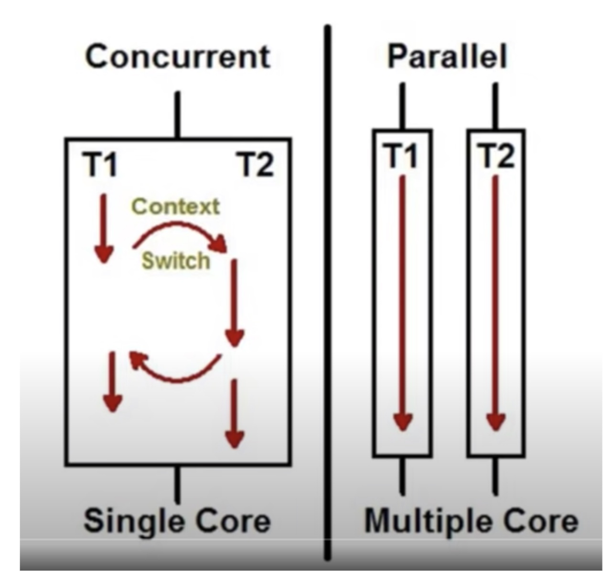

Recently, I gave a talk at work titled `C# - Concurrency, Parallelism and Threads`. Naturally, I spent a lot of time reading blogs and books about this topic. Here is my attempt to retain some of that information for me to go refresh my concepts when needed.

First, and the most important concept that we will need to remind ourselves is that `Concurrency` and `Parallelism` are not the same thing. Here is a screenshot to summarize this. The screenshot is borrowed from this pretty useful [Youtube video](https://www.youtube.com/watch?v=8Je1W82vwYM) by Questpond.



Concurrency is when you have multiple tasks in progress. Note that these tasks need to be independent and can be executed in any order. Concurrency is the concept - it is how you break down your problem into sub-problems that are independent of each other. [Here](https://learn.microsoft.com/en-us/dotnet/csharp/programming-guide/concepts/async/) is a C# example from Microsoft for breaking down problems and using C# libraries to execute them concurrently. 

** Synchronous problem solving **

```
static void Main(string[] args)
{
    Coffee cup = PourCoffee();
    Console.WriteLine("coffee is ready");

    Egg eggs = FryEggs(2);
    Console.WriteLine("eggs are ready");

    Bacon bacon = FryBacon(3);
    Console.WriteLine("bacon is ready");

    Toast toast = ToastBread(2);
    ApplyButter(toast);
    ApplyJam(toast);
    Console.WriteLine("toast is ready");

    Juice oj = PourOJ();
    Console.WriteLine("oj is ready");
    Console.WriteLine("Breakfast is ready!");
}

```

** Concurrent problem solving **

```
static async Task Main(string[] args)
{
    Coffee cup = PourCoffee();
    Console.WriteLine("coffee is ready");

    var eggsTask = FryEggsAsync(2);
    var baconTask = FryBaconAsync(3);
    var toastTask = MakeToastWithButterAndJamAsync(2);

    var eggs = await eggsTask;
    Console.WriteLine("eggs are ready");

    var bacon = await baconTask;
    Console.WriteLine("bacon is ready");

    var toast = await toastTask;
    Console.WriteLine("toast is ready");

    Juice oj = PourOJ();
    Console.WriteLine("oj is ready");
    Console.WriteLine("Breakfast is ready!");
}
```

A word of caution! We have now solved the problem using concurrency. However, this can still be executed by a single thread (that is time splicing) on a single core. That means, we have not introduced `Parallel programming` yet. [Here](https://github.com/joshi-aparna/asp_thread_demo/blob/master/ThreadDemo/AsyncDemo.cs) is my own version of the same problem that I used in the talk.

Now, the decision to use parallel threads to execute these independent tasks is left to the `Common Language Runtime` or the `CLR`, which makes this decision depending on the operating system, the number of cores on the machine, etc. CLR maintains a thread pool that it puts to work when there are async operations to be performed. The size of the thread pool determines the parallelism of the program.

CLR understands that having too many threads is not a good thing. Threads might end up spending so much time in context switching to do useful work. It uses two algorithms to ensure optimum number of threads.
1. Starvation avoidance: Too many threads is a bad thing. However, if all the threads created so far are waiting for a new thread to be created and to wake them up, then CLR will create the new thread. The highest priority is to avoid starvation.
2. Hill Climbing Heuristic: This is an algorithm that works on finding local maxima. The CLR keeps track of the number of threads, the number of completed tasks at all times. For a given sample time, it uses the Hill Climbing algorithm to determine what is the max thread count to get the highest throughput. If the max thread count advised is higher than the current thread count, then a new thread is created. Otherwise, the existing threads are killed once they complete their current tasks.

CLR runs this algorithm every 500ms and every time a task is complete. I found a cool blog post [here](https://mattwarren.org/2017/04/13/The-CLR-Thread-Pool-Thread-Injection-Algorithm/) that explains the algorithm in more detail. At the time of writing this, the "managed" threads created and maintained by the CLR has a 1-to-1 map to the kernel threads created by the operating system ([source](https://github.com/dotnet/runtime/blob/main/docs/design/coreclr/botr/intro-to-clr.md#threading)). However, this exists behind an abstraction and hence can change in the future.

#### Resources
1. [Concurrency vs Parallelism - Questpond](https://www.youtube.com/watch?v=8Je1W82vwYM)
2. [Concurrency is not Parallelism by Rob Pike](https://www.youtube.com/watch?v=oV9rvDllKEg)
3. [Asynchronous programming patterns - Microsoft](https://learn.microsoft.com/en-us/dotnet/standard/asynchronous-programming-patterns/)
4. [Asynchronous programming with async and await - Microsoft](https://learn.microsoft.com/en-us/dotnet/csharp/programming-guide/concepts/async/)
5. [Understanding threads assignment in async/await](https://stackoverflow.com/a/33829420/3773974)
6. [Task Wait v/s Await](https://olegignat.com/task-wait-or-await-task/)
7. [How Worker Threads Are Managed](https://learning.oreilly.com/library/view/clr-via-c/9780735668737/ch27.html#how_worker_threads_are_managed)
8. [Hill Climbing Concurrency Controller - Research paper](https://www.researchgate.net/publication/228977836_Optimizing_concurrency_levels_in_the_net_threadpool_A_case_study_of_controller_design_and_implementation)

