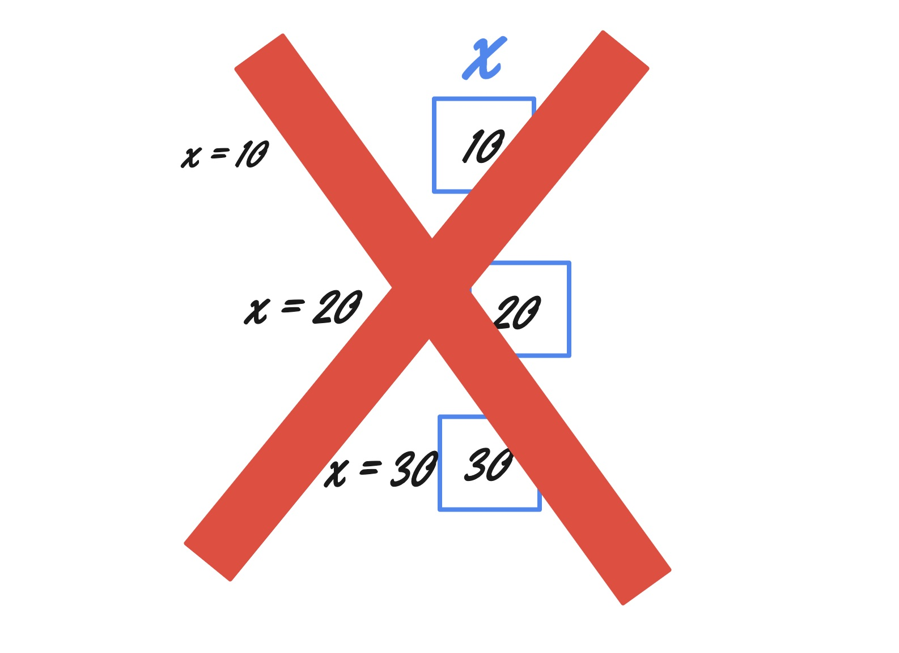

I completed a course on [Functional Programming](https://www.linkedin.com/learning/functional-programming-with-java/functional-programming-a-new-way-to-organize-code) on LinkedIn Learning and here is what I want to remember from it. 

### What is Functional Programming?
Funcational Programming is a declarative way of programming. 

### What is Declarative Programming, you ask? :grinning:
Let's think of it this way. You are aware of Object Oriented Programming (OOP), right? So OOP is imperative style. Let us compare Functional Programming to Object Oriented Programming to understand what is "declarative style". 

So, in imperative style (object oriented programming), we describe how something is done; step by step. In declarative style, is define what that something is. 
Let us see an example - Find average of numbers in an array
| Imperative | Declarative |
| :----: | :----:   |
| set x to 0 <br> add first element of array to x <br> repeat until end of array <br> divide x by number of elements in array | x is sum of elements divide by number of elements|

Both descriptions mean the same. But notice that the declarative way is defining what average is while the imperative style is telling us how to calculate the average. 

`average = sum of all elements / number of elements`

In another words, Functional Programming is very close to mathematical equations.

### Core concepts of Funcational Programming

#### Immutability
Remember how we assign different values to a variable through out the program? Remember how we use setters in classes to modify the value of class variables? Yeah, all that is not allowed in Functional Programming. A variable once set remains unchanged. Sort of like, making all variables `final` :angel:
Think of it this way. We usually think of variables as vessels that hold the values. The vessel can hold different values at different times (remember pointers?). But in Funcational Programming, variables are just another name for their values. Like, PI is always 3.14... Ever imagined a different value for PI? No? In the same way, every x, y, z in your program can now have a single value. 

So, what do we do when we want the value changed, you ask?
```
   Employee john = new Employee("John", "10$")
   Employee updatedJohn = new Employe("John", "20$") // we do this instead of john.setSalary("20$)
```

#### Functional Purity
If a function returns same value for the same argument every time, then the function is pure. That generally means that, the function cannot use any state values that could potentially change. 

Example of an impure function:
```
   class Employee {
       int salary;
       void setSalary(int salary) {
           this.salary = salary;
       }
       int getBonus(int percentage) {
           if(this.salary > 10000) 
                return this.salary * percentage;
            else
                return  this.salary * percentage + 500;
       }
   }
```
Observe that the value of getBonus changes if the salary of the employee changes. 
So, what is an example of a pure function?

```
int add(int x, int y) {
    return x + y;
}
```
Observe that all the logic for computation involves only the inputs and the variables declared inside the function. 

#### First Class Functions

In OOP we treat data and functions separately. In FP, they are all the same. We can create an array of functions, pass a function as argument, return a function from a method.

If you have a class and method like this:
```
    class MyClass {
        public myMethod(int myArg) {
            return myArg * 2
        }
    }
```
You can assign this to a variable like this:
```
     x = MyClass::myMethod //We are not calling the method here. 
```
Or you could define a new function 
```
    x = (y) -> {
        return y * 2;
    }
```

Java provides a `Function` interface to do this. 
```
    Function<Integer,Integer> x = MyClass::myMethod
    x.apply(4) -> 8
```
One annoying thing is that this interface works only for functions that take 1 argument. What about functions with more arguments or no arguments? Well, there is `BiFunction` interface for functions that take two arguments. For anything more, you can define your own interface. All that's required is you define the `apply()` method. For example:

```
    interface ThreeArgFunction<T,U,V,R> {
        R apply(T t,U u,V v);
    }
    ThreeArgFunction<Integer, Integer, Integer, Integer> addThree = (x,y,z) -> {return x + y + z;}
```
So where is this useful? An example is a dataloader that loads data from database in production environment and gives some dummy data in development environment. All the logic of how the data is loaded is inside the dataloader. The calling method need not be aware of this. 
```
class DataLoader {
    public final NoArgFunction<Employee> loadData;

    public DataLoader(boolen isProductionEnv) {
        loadData = isProductionEnv? this::datafromDatabase : this::dataForTesting
    }
    private Employee datafromDatabase() {
        return database.get();
    }

    private Employee dataForTesting() {
        return new Employee('aparna', 10);
    }
}
```

In functional programming, we can also pass funcations are arguments to other functions. Example:
- [Map](https://docs.oracle.com/javase/8/docs/api/java/util/stream/Stream.html#map-java.util.function.Function-)
- [Filter](https://docs.oracle.com/javase/8/docs/api/java/util/stream/Stream.html#filter-java.util.function.Predicate-)
- [Reduce](https://docs.oracle.com/javase/8/docs/api/java/util/stream/Stream.html#reduce-java.util.function.BinaryOperator-)
- [Collect](https://docs.oracle.com/javase/8/docs/api/java/util/stream/Stream.html#collect-java.util.stream.Collector-)

### Advanced Concepts
In the course, there are a few advanced concepts that were touched upon. I will learn them in depth another day, maybe.
#### Partial Application 
Let's say there is a function that takes three arguments. Usually, we need to be aware of all three values to call this function, right? In partial application, the three arguments are provided at different times. I could not find a decent blog that explains this well. [Here](https://en.wikipedia.org/wiki/Partial_application) is the wikipedia page.

#### Recursion
Recursion is when a function calls itself and an end condition exists in the function to stop the method call. We could talk about this in depth another day. For now, [here](https://dzone.com/articles/functional-programming-recursion) is a good explanation. 

#### Composition
This is a method where we take simple functions and combine them into a more complex function. Let's say we have two methods `f(x) = x * 2   //(timesTwo)` and `f(x) = x - 1   // (minusOne)`. And we want to compute `f(x) = 2x -1 `. You call the `timesTwo` function first. With the output of `timesTwo`, you call the `minusOne` function. How would you code this? 
```
    timesTwo.andThen(minusOne)
```
The requirement here is that the next function takes as argument the same type that the previous function returns.
