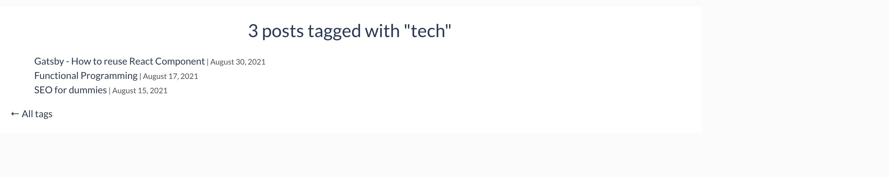

I started this blog using the template present in the github repository [here](https://github.com/wangonya/flexible-gatsby). The template came with a `/tags/<<tagname>>` page where the page lists all the blog posts with the tag `<<tagname>>`. The tags page looked like this:


I decided that the tags page should look similar to the blog's landing page with the posts filtered depending on the selected tag. There are two implications to this.

1. The tags page should get the same set of fields in the input as the landing page.  
   The default tags page did not need the excerpt of the post, the title image, the "timeToRead" value. Therefore the graphql query used by the tags page needed to be updated to include these fields. If you ignore the pagination in the landing page, the queries used in both pages are almost the same. The tags page has a filter for the tag, of course. You can find the queries [here](https://github.com/joshi-aparna/blog/blob/97f727901703e351f0df96513d648786fcf82b77/src/templates/blog-list.js#L60) and [here](https://github.com/joshi-aparna/blog/blob/97f727901703e351f0df96513d648786fcf82b77/src/templates/tags.js#L41). 

2. The UI of the tags page should be changed to make it appear similar to the landing page
    Now that I had all the data required in the tags page, it was time to change the UI of the tags page. Making it appear like the landing page also meant that there would be code duplication for the common components. This post is all about how I went about extracting the common code and reused it to make the tags page. 

#### Create a common component
The landing page is a list of all posts. Each post is made of the image, the title, an excerpt and the date of the post. Let's call this a blog-item. I created a new component in `src/templates` directory called `blog-item.js`. The class `BlogItems` exported from this file is a component on its own and hence it extends `React.Component`. 
In Gatsby, the input to a component comes in the form of `this.props`. So, I extracted the posts to be displayed on the variable called `items`.
```
const posts = this.props.items
```
Once I have the items (posts) that needed to be displayed, I iterate through them.
```
posts.map(({ node }) => {
    // return the HTML code here
})
```
You can find the code for the blog-items component [here](https://github.com/joshi-aparna/blog/blob/97f727901703e351f0df96513d648786fcf82b77/src/templates/blog-item.js#L8)


#### Using the created component
Now that the common component `BlogItems` is created, it can be used both in the landing page and the tags page of the blog. The component requires `items` as input. 
```
<BlogItems items={posts} />
```

Place this tag where you need in the page. In the landing page, this component is placed just before the dive for pagination. In the tags page, the component is placed in the main div just below the tag header. And, that's it. The [tags page](/tags/tech/) now appears as:


