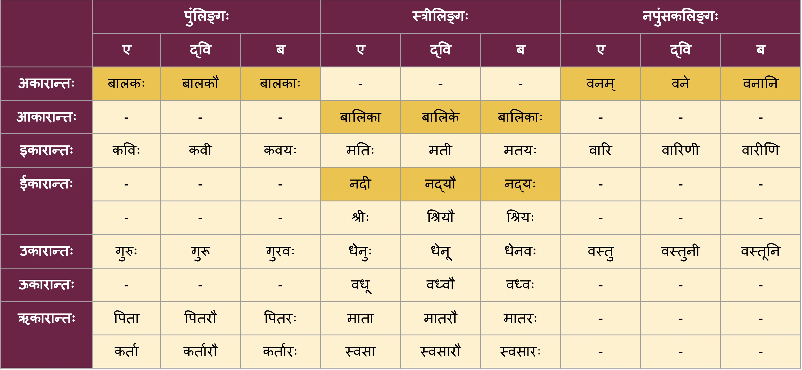

Sanskrit has always fascinated me. But, I chose not to learn it in school when I had the opportunity. I regret that decision. Now, I am redeeming myself.
I have been attending online classes to learn Sanskrit for the last 10 weeks. It has been a humbling experience. Sanskrit is a language that needs practice. A lot of it. I wish there was a tool such as Duolingo to practice. Unfortunately, I could not find such a tool. So, I decided to build one. 

I digress. Attending regular classes (online classes are a norm during Covid times, right?) after college has been interesting. If you know me, I particularly enjoy making notes in class. I am happy to share that I still enjoy it. Hey, I could share the notes here may be? That way I have it handy to look them up.

The classes are conducted by [Sanskrit.today](https://sanskrit.today/course/bhasha-pravesha-1/) every Thursday and Friday at 6.30 AM IST. Who knew I would be consistent in waking up early and finishing chores to make time for these classes :grin:

Our teacher, Mr. Ashok, started the lesson by teaching us the Sanskrit sentences for the question "What is your name?" and the answer to it. 
```
भवत: नाम किम्?
भवत्या: नाम किम्?
```

We then moved on to learning the __Prathama Vibhakti__ forms of simple words. Here is a very useful snapshot that was shared with us. There is a table in the Bhashapravesha text book as well. But I think this one is better. Full credits to [sanskrit.today](https://sanskrit.today/) for coming up with such tables. 



Let us practice it, shall we? You have to tell the 3 forms (__Eka-vachana__, __Dwi-vachana__ and __Bahu-vachana__) for each of the words that come up. Ofcourse, you have to identify the gender first.