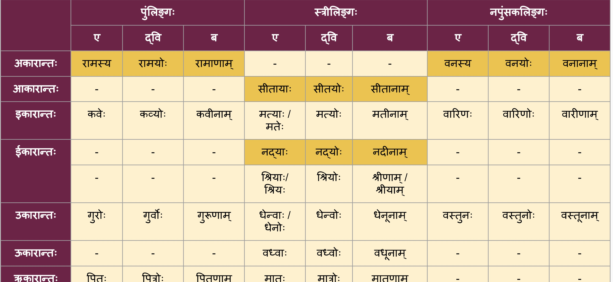

Let's talk about the _shashti vibhakti pratyaya_ today. This is called the "possessive case" in English. As the name says, it is used to show possession ownership or belonging. 

#### How do you form or identify shashti vibhakti? 
Most common formation of words in shashti vibhakti ends with -sya (-स्य​) for masculine and nuetral forms. They end with -या: for faminine forms. 
Example:
```
   राम​: -> रामस्य​
   सीता -> सीताया:
   देवी -> देव्या:
```
#### Commonly used words
Some special words we could remember and practice are:

```
   स​: -> तस्य​       सा -> तस्या:
   भवान् -> भवत​:     भवती -> भवत्या:

```
#### First person and second person application
Remember that we praticed the sentence "What is your name?" earlier [here](/sanskrit-prathama)? The word "your" is in shashti vibhakti. Do you remember the response to this question? When we say, "_My_ name is ____",  "_My_" is again in shashti vibhakti. So, what are the forms then?

```
   अहम् -> मम​
   त्वम्  -> तव​
```

#### So are these the only forms? Of course not :laughing:

I learnt this from the Sanskrit class organised by [sanskrit.today](https://sanskrit.today/course/bhasha-pravesha-1/). A very helpful table was shared by the teacher to practice and remember the forms of shashti vibhakti. Sharing it here (full credits to sanskrit.today).



With this, let us practice a few simple sentences in shahsti vibhakti. Most of the sentences here are from the Sanskrit textbook from [Samskrita Bharati](https://samskritabharati.in/)